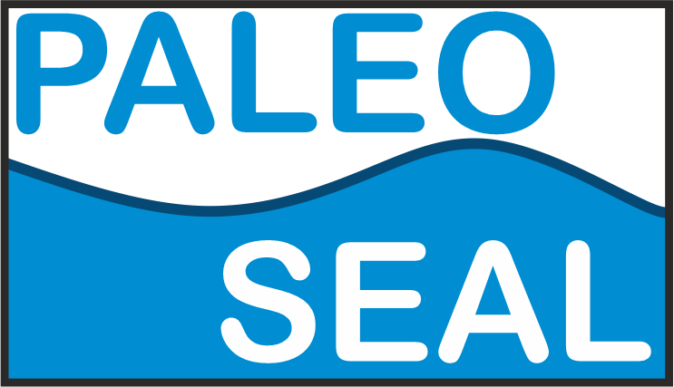

# PALEO-SEAL

## What is PALEO-SEAL?
PALEO-SEAL is an interface for the visualization and download of Holocene sea-level index points. The data displayed in the interface are hosted in a MySQL database. The sea-level data structure is standardized following the template of the HOLSEA project (www.holsea.org), and is described by Khan et al., 2019[1](#Khan2019).

## What data can I find in PALEO-SEAL?
PALEO-SEAL was initially developed to support a project based in South East Asia (see "About" section). As such, the initial dataset is limited to the one published in Mann et al., 2019[2](#Mann2019), that includes sea-level datapoints from Southeast Asia, Maldives, India and Sri Lanka. This database was successively updated and is kept current at this link: https://doi.org/10.17632/wp4ctb4667.1. As we move forward, we will keep incorporating data from other papers compiled following the standard HOLSEA template.

## How do I use PALEO-SEAL?
PALEO-SEAL is hosted at this <a href="https://warmcoasts.eu/SeaLevelInterfaceBeta/#!/">link</a>. The data can be accessed either via a Map or via a Data Explorer interface. 
Both Map and Data Explorer allow filtering which data to visualize by Region-Sub Region-Reference-Publication Year-Dating Method. An option to visualize all samples is also given. Once selected, the data can be visualized in the map or in an Age/RSL plot, and added to the export list. All samples added to the export list can be then downloaded as CSV files.
The Data Explorer Interface allows selecting single data points from the Age/RSL plot.

## Acknowledgments
PALEO-SEAL was developed as part of the project SEASCHANGE (*Holocene sea level changes in SE Asia*), funded by the German Science Foundation as part of the Special Priority Program (SPP)-1889 “Regional Sea Level Change and Society” (RO-5245/1-1). The interface builds on the data structure compiled by the HOLSEA project, funded by INQUA, the International Union for Quaternary Research.

PALEO-SEAL was coded by Jan Drechsel (IT consultant), under scientific supervision of Dr. Alessio Rovere (MARUM, University of Bremen). If you use the data in PALEO-SEAL, please remember to cite the original authors, and give credit to HOLSEA by citing Khan et al., 2019. Acknowledgments and citations of this code are always welcome, as are suggestions for improvement.

### References
<a name="Khan2019">1</a> Khan, N.S., Horton, B.P., Engelhart, S., Rovere, A., Vacchi, M., Ashe, E.L., Törnqvist, T.E., Dutton, A., Hijma, M.P. and Shennan, I., 2019. Inception of a global atlas of sea levels since the Last Glacial Maximum. Quaternary Science Reviews, 220, pp.359-371.
<a name="Mann2019">2</a> Mann, T., Bender, M., Lorscheid, T., Stocchi, P., Vacchi, M., Switzer, A.D. and Rovere, A., 2019. Holocene sea levels in southeast Asia, Maldives, India and Sri Lanka: the SEAMIS database. Quaternary Science Reviews, 219, pp.112-125. 

--------------------------JAN TEXT---------------------------
Private Work Repository for Paleo Sea Level Database Interface

Version 0.1.1 [PreRelease]

To Do:
* Introduction Text	
* Table Structure
* Export Dialog
	* landing Page: Table
	* plot with export: true
	* debug Map
	
* Clean Up: Structure & Architecture
	* Frontend - Backend - Scripts, functions, CSS.
